# Speed Market

## Participantes: 
- Isabelle Almeida
- Matheus Neves

## Backend implatado na nuvem:
- **Repositório**: [link](https://github.com/Matheus-SNeves/tcc-senai/tree/main)
- **Vercel**: [link](https://vercel.com/matheus-neves-projects-c6d97214/tcc-senai)
- **Back-end**: [link](https://tcc-senai-tawny.vercel.app/)

## Front-End do adm:
- **Repositório**: [link](https://github.com/Matheus-SNeves/web-admin-tcc)
- **Front-End do adm**:[link](https://matheus-sneves.github.io/web-admin-tcc/pages/login.html)

## Roteiro de testes:
- **Arquivo**: [link](./roteiro.md)

## Tarefas:
- [x] Escolher a metodologia **SCRUM, KANBAN, XP, outras**
- [x] Modelar o negócio no **Canvas**
- [x] Apresentar a proposta inicial
- [x] Criar um repositório no **github** e adicionar os integrantes do grupo como colaboradores.
- [x] Criar um cronograma **Gráfico Gant**
- [x] Elencar os **requisitos funcionais**
    - [x] Ilustrar cada **requisito funcional** com DCU (Diagrama de casos de Uso)
- [x] Modelar o banco de dados MER x DER Modelo conceitual
- [x] Iniciar um DC (Diagrama de Classes) Back-End
- [x] UML DC (Diagrama de Classes) **Back-end**
- [x] UML DA (Diagrama de Atividades) **Front-end**
- [x] Análise de viabilidade Matriz SWOT
- [x] Triângulo de Ferro Escopo, Prazo e Custo
- [x] Iniciar a codificação/desenvolvimento **Banco de dados**
- [x] Iniciar a codificação/desenvolvimento **Back-end**
- [x] Prótótipo Figma Front-end
- [x] Iniciar a codificação/desenvolvimento **Front-end**
- [x] Prótótipo Figma Mobile
- [ ] Iniciar a codificação/desenvolvimento **Mobile**
- [x] Back-End - CRUDs (Cadastro, Listagem, alteração e exclusão) das principais **tabelas**.
- [x] Back-Front - CRUDs das principais **Telas** com Responsividade.
- [x] Login com autenticação real (segurança JWT).
- [x] Integração do front com o back-end e banco de dados. 
- [x] Fluxo de navegação funcionando (Web e/ou Mobile).
- [x] Relatório de testes manuais **unitários**, **integração** e **ponto a ponto**.
- [x] Entregas através do repositório do projeto no GitHub, com evidências dos testes em relatório no formato PDF.
- [x] **Implantação** do Back-End em um serviço de nuvem (ex: Vercel, Heroku, AWS).
- [x] **Implantação** do Front-End em um serviço de nuvem (ex: Vercel, GitHub Pages).
- [ ] Iniciar o desenvolvimento do App **Mobile** (Funcionalidades principais).
- [ ] Testes de integração e ponto a ponto (Caixa preta e Caixa branca).
    - [x] Após o **back-end** implantado, Criar um Roteiro/check-list e testar manualmente (**Teste de integração: Back/BD**) a API a partir do **Insomnia** e documentar os testes. Tirando prints e fazendo um relatório. (**Caixa branca**).
    - [x] Após o **front-end** implantado, Criar um Roteiro/check-list para testar o **Front-End** manualmente (**Teste ponto a ponto**), fazer um relatório dos testes. (**Caixa branca**).
    - [ ] Criar um Roteiro/check-list (**teste de integração**) pedir para um colega de outro grupo testar a **API implantada** a partir do **Insomnia** e documentar os testes. Tirando prints e fazendo um relatório. (**Caixa preta**).
    - [ ] Criar um Roteiro/check-list (Teste **ponto a ponto**) pedir para um colega de outro grupo testar manualmente o **Front-End implantado** e fazer um relatório dos testes. (**Caixa preta**).
- [x] Revisão do cronograma do projeto.
- [x] Revisão da documentação.
    - [x] Matriz SWOT.
    - [x] DER atualizado ou UML Diagrama de Classes.
    - [x] Requisitos Funcionais e Não Funcionais.
        - [x] UML DCU (Diagrama de Caso de Uso).
- [] Para implantação cada stack (front-end, back-end e mobile) foi necessário criar um repositório separado para cada um no **GitHub**, deixar link dos repositórios no **README.md do repositório principal** do projeto, com todas as documentações em **PDF**.

## Gráfico Gantt:
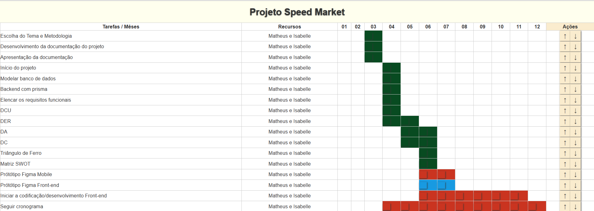

## Progresso:
|Semanas|Progresso|
|-|-|
|Semana 1| 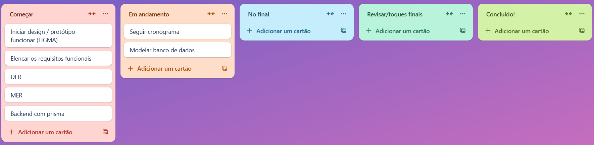|
|Semana 2| 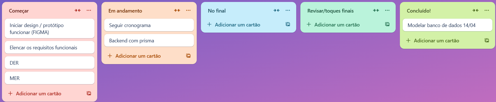|
|Semana 3.1| 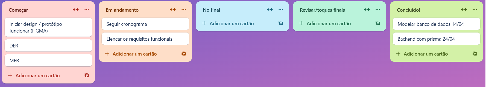|
|Semana 3.2| 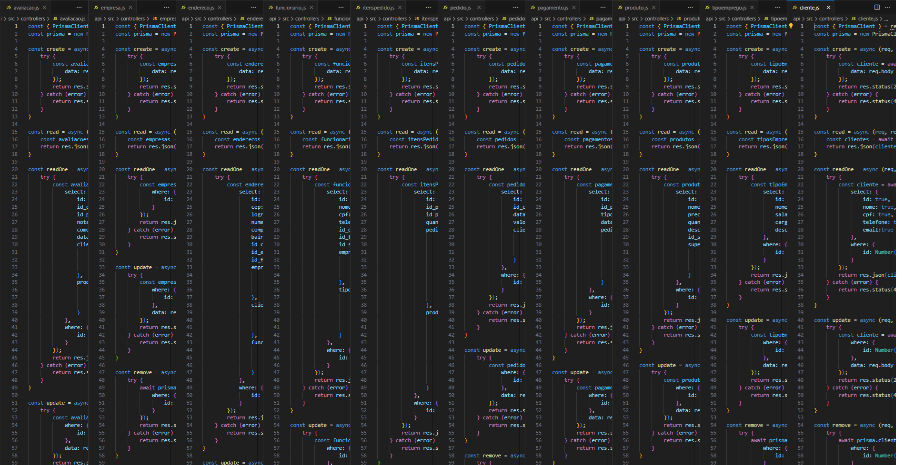|
|Semana 3.3| 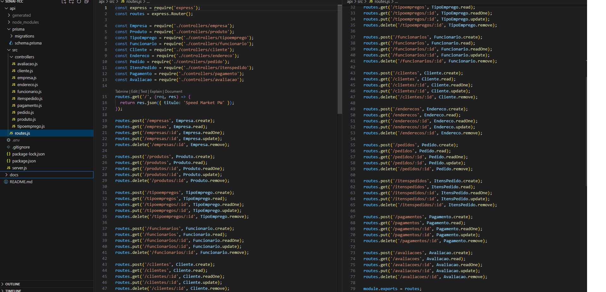|
|Semana 3.4| 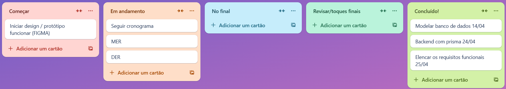|
|Semana 4| 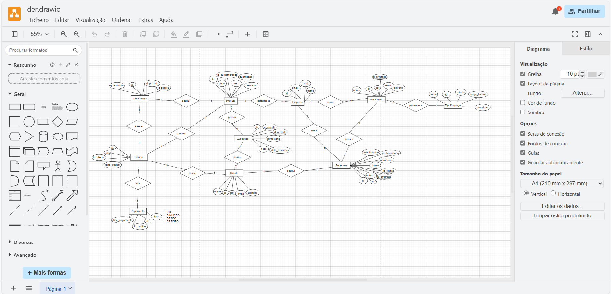|
| Mês 5 e 6 | 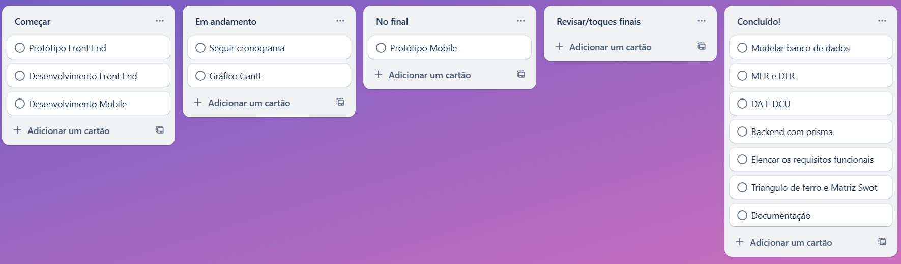

## Diagramas:
|Diagrama|Foto|
|-|-|
|DA| 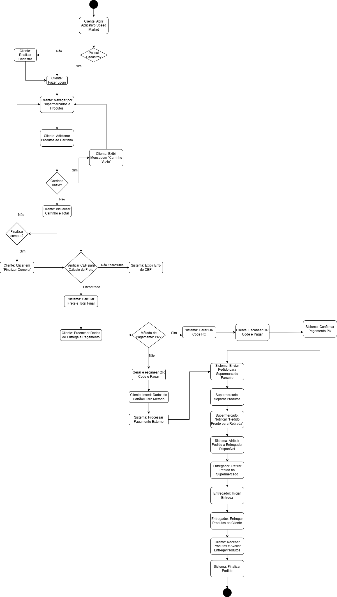|
|DC| |
|DCU| 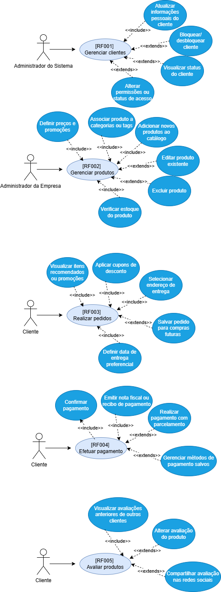|
|DER| 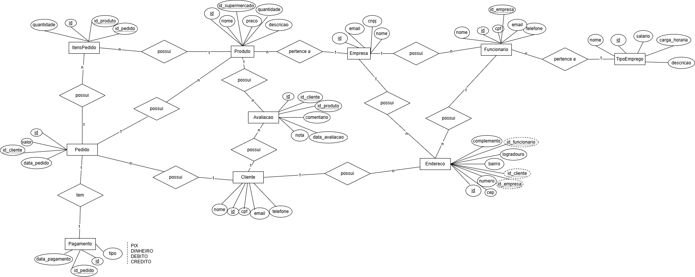|

## Requisitos Funcionais:
[***req***](./docs/reqFuncionais.txt)

## Cronograma:
[***cronograma***](./docs/cronograma.txt)

## Banco de Dados:
[***bd***](./docs/bd.txt)

## Protótipo Figma Mobile:
[***Link***](https://www.figma.com/design/4V3yrFrDjP3KDmGCCxzphi/Prototipo-Mobile-Speed-Market)

## Protótipo Figma Web:
[***Link***](https://www.figma.com/proto/OlHvhztXHYQJX8xR6OwxvU/Prototipo-Desktop-Speed-Market)

## Quadro Canvas:
[***canvas***](./docs/canvas(3).json)

# Obrigado

