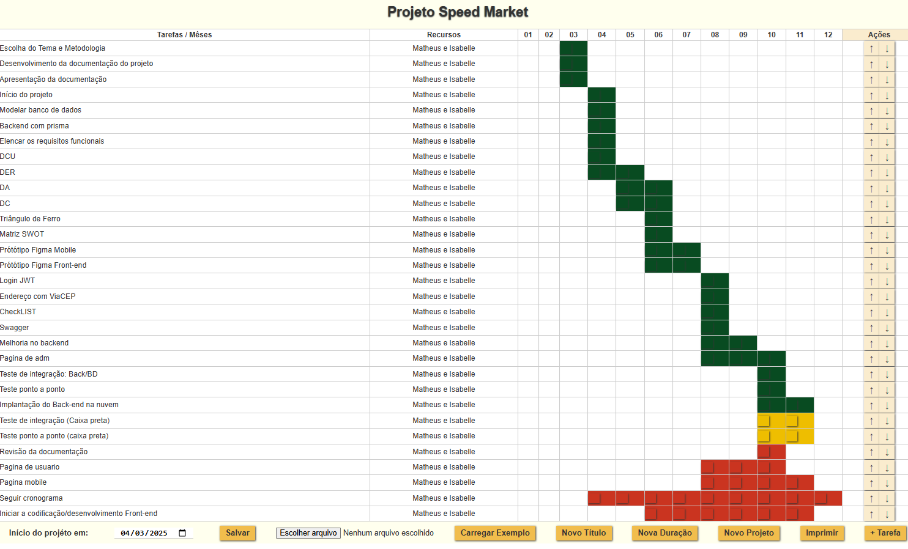

# Speed Market

## Participantes: 
- Isabelle Almeida
- Matheus Neves

## Tarefas:
- [x] Escolher a metodologia **SCRUM, KANBAN, XP, outras**
- [x] Modelar o negócio no **Canvas**
- [x] Apresentar a proposta inicial
- [x] Criar um repositório no **github** e adicionar os integrantes do grupo como colaboradores.
- [x] Criar um cronograma **Gráfico Gant**
- [x] Elencar os **requisitos funcionais**
    - [x] Ilustrar cada **requisito funciional** com DCU (Diagrama de casos de Uso)
- [x] Modelar o banco de dados MER x DER Modelo conceitual
- [x] Iniciar um DC (Diagrama de Classes) Back-End
- [x] UML DC (Diagrama de Classes) **Back-end**
- [x] UML DA (Diagrama de Atividades) **Front-end**
- [x] Análise de viabilidade Matriz SWOT
- [x] Triângulo de Ferro Escopo, Prazo e Custo
- [x] Iniciar a codificação/desenvolvimento **Banco de dados**
- [x] Iniciar a codificação/desenvolvimento **Back-end**
- [ ] Prótótipo Figma Front-end
- [ ] Iniciar a codificação/desenvolvimento **Front-end**
- [x] Prótótipo Figma Mobile
- [ ] Iniciar a codificação/desenvolvimento **Mobile**

## Gráfico Gantt:

## Progresso:
|Semanas|Progresso|
|-|-|
|Semana 1| |
|Semana 2| |
|Semana 3.1| |
|Semana 3.2| |
|Semana 3.3| |
|Semana 3.4| |
|Semana 4| |
| Mês 5 e 6 | 

## Diagramas:
|Diagrama|Foto|
|-|-|
|DA| |
|DC| |
|DCU| |
|DER| |

## Requisitos Funcionais:
[***req***](./docs/reqFuncionais.txt)

## Cronograma:
[***cronograma***](./docs/cronograma.txt)

## Banco de Dados:
[***bd***](./docs/bd.txt)

## Protótipo Figma Mobile:
[***Link***](https://www.figma.com/design/4V3yrFrDjP3KDmGCCxzphi/Prototipo-Mobile-Speed-Market)

## Protótipo Figma Web:
[***Link***](https://www.figma.com/proto/OlHvhztXHYQJX8xR6OwxvU/Prototipo-Desktop-Speed-Market)

## Quadro Canvas:
[***canvas***](./docs/canvas(3).json)

## Arquivos:
Backend está na pasata api e os documentos estão na pasta docs(contém arquivos em pdf, drawio, txt, png, gif, json e fig)

# Obrigado

