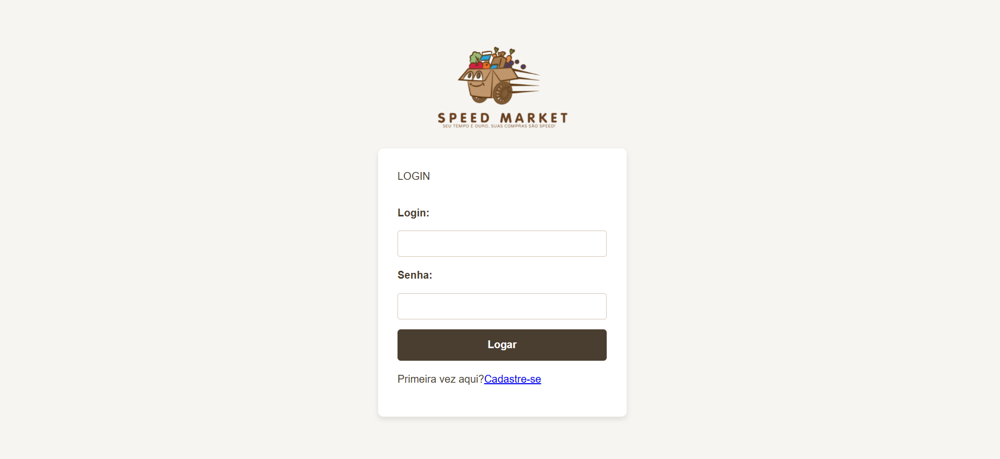

# Roteiro de Testes para o Speed Market

## 1. Teste de login e cadastro

**Objetivo:** Verificar se o sistema permite adicionar um ADMIN

### Passos:
- [ ] Acesse a aplicação.
- [ ] Preencha os campos "Login" e "Senha".
- [ ] Caso você não tenha um login ainda, faça o cadastro e depois volte ao login para validar seu acesso.
- [ ] Clique no botão "Logar    ".

### Resultado Esperado:
- [ ] O login deve funcionar e dar acesso às tabelas.

---

## 2. Teste de CRUD Completo de Produtos
**Objetivo**: Verificar se o sistema permite a criação, leitura, edição e remoção de produtos.

**A. Criação (Cadastro)**
### Passos:
[ ] Acesse a tela de Produtos.
[ ] Preencha o formulário de Cadastro de Produtos (ex: Nome, Preço, Estoque, Descrição, Categoria, ID Supermercado).
[ ] Teste de Validação de Campo Opcional: Deixe o campo "Link da Imagem" vazio.
[ ] Clique no botão "Cadastrar".

Resultado Esperado (Criação):
[ ] O sistema deve exibir a mensagem de confirmação "Produto cadastrado com sucesso!".
[ ] A lista de produtos (tabela) deve ser recarregada, e o novo produto deve aparecer na última linha.

**B. Leitura e Edição (Update)**
### Passos:
[ ] Verifique se os produtos são listados, mostrando os campos: ID, Nome, Preço, Estoque, Categoria, Super. ID e Imagem.

[ ] Clique duas vezes na célula "Preço" de um produto e altere o valor.
[ ] Clique duas vezes na célula "Imagem" e substitua o link (URL) por um novo link válido.
[ ] Clique no botão "Alterar" na mesma linha.

Resultado Esperado (Edição):
[ ] O sistema deve exibir a mensagem de confirmação "Produto alterado com sucesso".
[ ] A tabela deve refletir o novo Preço e o novo link da Imagem.

**C. Remoção (Delete)**
### Passos:
[ ] Na lista de produtos, encontre um registro de teste.
[ ] Clique no botão "Excluir" na linha do produto.
[ ] Confirme a exclusão na caixa de diálogo (confirm).

Resultado Esperado (Remoção):
[ ] O sistema deve exibir a mensagem de confirmação "Produto excluído com sucesso!".
[ ] O produto deve ser removido da lista e a página deve ser recarregada.

## 3. Teste de Edição (Update) de Clientes
**Objetivo:** Verificar se os dados dos clientes podem ser lidos e atualizados (foco em R+U).

### Passos:
[ ] Acesse a tela de Clientes.
[ ] Verifique se os clientes/usuários são listados com os campos: ID, Nome, CPF, Telefone, Email, Empresa ID e Cargo ID.
[ ] Clique duas vezes na célula "Email" de um cliente e altere o endereço de e-mail.
[ ] Altere o "Cargo ID" (célula editável).
[ ] Ação: Clique no botão "Alterar" na linha.

Resultado Esperado:
[ ] O sistema deve exibir uma mensagem de sucesso para a alteração.
[ ] Os dados do cliente devem ser atualizados na tabela e no banco de dados.

## 4. Teste de CRUD Genérico para Outras Tabelas
**Objetivo**: Garantir a funcionalidade básica de gerenciamento de dados em todas as demais telas administrativas.

### Passos:
Para as telas de Pedidos, Empresas, Tipos de Emprego, Avaliações, Pagamentos e Endereços:

[ ] (Read/Leitura): Acesse cada uma dessas telas e verifique se os dados são carregados corretamente.
[ ] (Create/Criação): Se houver um formulário de cadastro, preencha-o e envie-o.
[ ] (Update/Atualização): Tente editar uma célula editável (se houver) ou use o botão "Alterar" em um registro.
[ ] (Delete/Exclusão): Use o botão "Excluir" para remover um registro de teste.

Resultado Esperado:
[ ] (Read): A tabela deve ser preenchida sem a mensagem "Erro ao carregar...".
[ ] (Create): O novo registro deve ser adicionado à lista.
[ ] (Update): As alterações devem ser salvas e refletidas na tabela.
[ ] (Delete): O registro deve ser removido com sucesso e a lista atualizada.

## 5. Teste de Navegação e Painel Principal (Dashboard)
**Objetivo**: Verificar a usabilidade do painel de navegação lateral.

### Passos:
[ ] A partir de qualquer tela (ex: Produtos), clique em "Dashboard" na barra lateral de navegação (<nav id="admin-nav">).
[ ] A partir do Dashboard, navegue por todos os links da barra lateral (Pedidos, Clientes, Produtos, etc.).
[ ] Clique no botão "Sair" (#logout-btn) no cabeçalho.

Resultado Esperado:
[ ] (Navegação): Todas as telas devem carregar sem erros. O item de navegação da tela atual deve estar com a classe active.
[ ] (Logout): O usuário deve ser redirecionado para a tela de Login.

## 6. Teste de Validação de Entrada
**Objetivo**: Garantir que o sistema valide as entradas corretamente no formulário de Cadastro de Produtos.

### Passos:
[ ] Acesse a tela de Produtos.
[ ] Preço: Tente inserir um valor não numérico no campo "Preço".
[ ] ID Supermercado: Deixe o campo "ID do Supermercado" vazio.
[ ] Campos required: Deixe o campo "Nome do Produto" vazio.
[ ] Tente submeter o formulário.

Resultado Esperado:
[ ] O sistema deve impedir a submissão e o navegador deve exibir mensagens de erro do HTML5 (required ou type="number").

## 7. Teste de Responsividade
**Objetivo**: Verificar se o layout é responsivo em diferentes tamanhos de tela (apesar das correções CSS para desktop).

### Passos:
[ ] Abra a aplicação em um navegador e acesse a tela de Clientes (que tem mais colunas).
[ ] Reduza a largura da janela para simular dispositivos móveis (largura menor que 768px).
[ ] Verifique se o menu lateral (.sidebar) se esconde ou se transforma em algo mais compacto.
[ ] Verifique a disposição dos elementos na tabela (.table-container) e se as células ainda são legíveis.

Resultado Esperado:
[ ] O layout deve se ajustar corretamente e permanecer funcional. A tabela deve ter um scroll horizontal ou as colunas devem se reajustar (formato card/mobile).

## 8. Teste de Feedback do Usuário
**Objetivo**: Verificar se o sistema fornece feedback apropriado ao usuário em todas as ações principais.

### Passos:
[ ] (Sucesso): Adicione um produto. Edite um cliente. Exclua um pedido.
[ ] (Erro - 401): Tente realizar uma ação depois que o token de autenticação expirar.
[ ] (Erro - Rede): Desconecte a internet e tente carregar os produtos.

Resultado Esperado:
[ ] (Sucesso): O sistema deve exibir mensagens de confirmação (alert) como "Produto cadastrado com sucesso!" ou "Alteração realizada!".
[ ] (Erro - 401): O sistema deve exibir o alerta "Sessão expirada. Faça login novamente." e redirecionar para login.html.
[ ] (Erro - Rede): O sistema deve exibir a mensagem "Erro de rede ao carregar [dados]." no lugar da tabela.